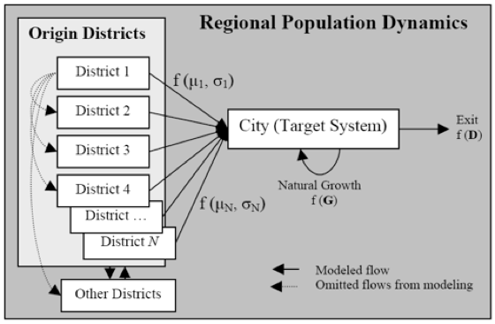

#  An Integrated Simulation Framework to Explore Spatio-temporal Dynamics of Slum Formation in Ahmedabad, India 

Models exploring slum formations (Updated to NetLogo 6.1.0).

**OriginalModel: Needs updating.**

**DES: Needs updating.**

# Data and Models

## Housing Dynamics Module at the City Level

Click on the image belwo to see a YouTube movie of the model:

Download the model [OriginalModel](OriginalModel)

## Population Growth in DES Framework 

Download the DES model [DES_Model](DES_Model)

Download the DES model integrated with the ABM [DES_and_ABM_Integrated_Model](DES_and_ABM_Integrated_Model)

## Integrated Model 
 
 Click on the image belwo to see a YouTube movie of the model:

 
 
Download the model [(GIS DES and ABM Integrated Model)](GIS_DES_and_ABM_Integrated_Model)

## Slum Locations 

Download the data [(Geodatabase.zip)](Geodatabase.zip)

## References

**Publications relted to this project:**

* **Patel, A., Crooks, A.T. and Koizumi, N. (2018)**, Spatial Agent-based Modeling to Explore Slum Formation Dynamics in Ahmedabad, India, in Thill J.C. and Drajicavic, S. (eds.), *Geocomputational Analysis and Modeling of Regional Systems*, Springer, New York, NY, pp 121-141. [(pdf)](https://www.dropbox.com/s/4ii6n162lsnjyb6/Slums_Patel_2018.pdf?dl=0) 
* **Patel, A., Koizumi, N. and Crooks, A.T. (2014)**, Measuring Slum Severity in Mumbai and Kolkata: A Household-based Approach, *Habitat International*, 41: 300-306. [(pdf)](https://www.dropbox.com/s/l9dhf8myq1jc8rb/SSI.pdf?dl=0)
* **Patel, A., Crooks, A.T. and Koizumi, N. (2012)**, Slumulation: an Agent-based Modeling Approach to Slum Formations, *Journal of Artificial Societies and Social Simulation*, 15 (4): 12. Available at [http://jasss.soc.surrey.ac.uk/15/4/2.html](http://jasss.soc.surrey.ac.uk/15/4/2.html) 
* **Patel, A., Crooks, A. T. and Koizumi, N. (2012)**, Simulating Spatio-Temporal Dynamics of Slum Formation in Ahmedabad, India. *6th Urban Research and Knowledge Symposium - Rethinking Cities: Framing the Future*, Barcelona, Spain. [(pdf)](https://www.dropbox.com/s/e9qtg0r1sidxcvt/Patel-et-al.pdf?dl=0)
 
**Conference Papers:**

* **Patel, A., Crooks, A.T. and Koizumi, N. (2014)**, Simulating Slum Policies Using a Spatial Multi-Agent Decision Support System, *61st Annual North American Meetings of the Regional Science Association International*, 12th -15th, November, Washington, DC. [(pdf)](https://www.dropbox.com/s/5qrt9l7vrd0kl8x/Abstract_Slum_NARSC2014.pdf?dl=0).
* **Patel, A., Crooks, A.T. and Koizumi, N. (2013)**, A Spatial ABM Approach to Explore Slum Formation Dynamics in Ahmedabad, India, *The Association of American Geographers (AAG) Annual Meeting*, 9th -13th April, Los Angeles, CA. [(pdf)](https://www.dropbox.com/s/15r98kl5wr9vcfc/Patel_AAG.pdf?dl=0).
* **Patel, A., Crooks, A. T. and Koizumi, N. (2012)**, Integrating GIS and ABM to Explore Spatio-temporal Dynamics of Slum Formation in Ahmedabad, India, *59th Annual North American Meetings of the Regional Science Association International*, 7th -10th, November, Ottawa, Canada. [(pdf)](https://www.dropbox.com/s/t708bwqkz8etu15/Abstract_Patel_Crooks_Koizumi_NARSC2012.pdf?dl=0).
* P**atel, A., Crooks, A. T. and Koizumi, N. (2012)**, Integrating GIS and ABM to Explore Spatio-temporal Dynamics of Slum Formation in Mumbai, India, *The Association of American Geographers (AAG) Annual Meeting*, 24th -28th February, New York, NY. [(pdf)](https://www.dropbox.com/s/jpq6mqe8oy9f98x/patelAAG.pdf?dl=0).
* **Patel, A., Koizumi, N. and Crooks, A. T. (2011)**, Defining Slum Severity in Indian Mega-cities: a Comparison of Mumbai and Kolkata, *Joint North American Meetings of the Regional Science Association International (RSAI) and Second Conference of the Regional Science Association*, 9th-12th November, Miami, FL. [(pdf)](https://www.dropbox.com/s/ah3ru26cao9723m/RSAI.pdf?dl=0).
